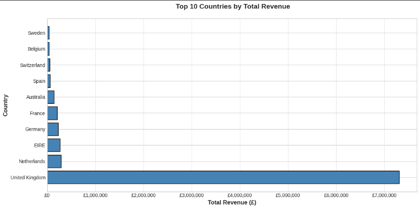

# 📊 CodeAlpha Internship — Task 2: Exploratory Data Analysis (EDA)

## 👤 Author
**Raghad ALLOUSH**  
Data Analytics Intern @ CodeAlpha | Master's Student @ Lebanese University  
[LinkedIn](https://www.linkedin.com/in/raghad-alloush-849093295/) | [GitHub](https://github.com/raghad612)

## 📌 Overview
EDA project analyzing 541,909 e-commerce transactions to identify product trends, value drivers, and customer insights.  
Tools: Python, Pandas, Matplotlib | Platform: Google Colab (cloud-based)

## 🔍 Questions Answered
1. What proportion of orders include each product?
2. Which product has the highest average order value?
3. Which customer segment (by country) generates the most revenue?

## 🧹 Data Cleaning Decisions
| Issue | Action | Reason |
|-------|--------|--------|
| Mixed date formats | `format='mixed'` in `pd.to_datetime()` | Handle US/UK variations |
| Negative values | Filter `Quantity > 0`, `UnitPrice > 0` | Exclude returns/cancellations |
| Missing CustomerID | Filter `CustomerID.notnull()` | Focus on registered customers |
| Shipping fees | Exclude "POSTAGE/SHIPPING/DELIVERY" | Not actual products |
| Items < £1 | Exclude from value analysis (Q2) | Focus on substantial products |

## 📈 Key Findings

### Q1: Product Frequency
| Rank | Product | % of Orders |
|------|---------|------------|
| 1 | WHITE HANGING HEART T-LIGHT HOLDER | 10.64% |
| 2 | REGENCY CAKESTAND 3 TIER | 9.19% |
| 3 | JUMBO BAG RED RETROSPOT | 8.63% |

### Q2: Highest Average Value
| Rank | Product | Avg Price (£) |
|------|---------|--------------|
| 🥇 | PICNIC BASKET WICKER 60 PIECES | 649.50 |
| 🥈 | Manual | 175.29 |
| 🥉 | RUSTIC SEVENTEEN DRAWER SIDEBOARD | 158.08 |

### Q3: Revenue by Country
| Rank | Country | Total Revenue (£) |
|------|---------|------------------|
| 🥇 | United Kingdom | 7,308,391.55 |
| 🥈 | Netherlands | 285,446.34 |
| 🥉 | EIRE | 265,545.90 |

## 💡 Business Recommendations
1. **Inventory**: Stock decorative items (high frequency) + premium baskets (high value)
2. **Marketing**: Feature UK success stories; test campaigns in France/Germany
3. **Risk**: Diversify beyond UK dependency (96% of revenue)

## 📂 Files
- `EDA_analysis.ipynb` — Complete reproducible code
- `country_revenue_chart.png` — Key visualization
- `dataset.csv` — Source data

---
*Project completed: March 2026 | CodeAlpha Data Analytics Internship*
